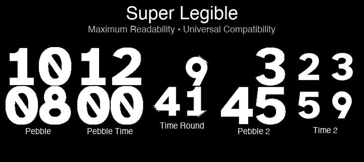

# Superlegible

A minimalist Pebble watchface focused on maximum readability using the Atkinson Hyperlegible font.


[](https://buymeacoffee.com/codedbydan)

<p align="center">
  
</p>

## Features

- **Maximum Size**: Time displayed as large as possible
- **Ultimate Simplicity**: Just the time, nothing else
- **Maximum Legibility**: Atkinson Hyperlegible font designed by Braille Institute
- **Auto Time Format**: Automatically detects and respects your system 12h/24h preference
- **Universal**: Works on all 5 Pebble platforms
- **Battery Efficient**: Updates only once per minute

## Installation

### Manual Installation

1. Download the `.pbw` file from the [Releases](https://github.com/dan-hart/pebble-superlegible-watchface/releases) page
2. Open the Pebble app on your phone
3. Go to Settings → Apps
4. Tap "Install Watch App"
5. Select the downloaded `.pbw` file

### Building from Source

**Prerequisites**:
- Python 3.x: `brew install python`
- UV package manager: `curl -LsSf https://astral.sh/uv/install.sh | sh`
- Pebble SDK: `uv tool install pebble-tool`
- [Peekaboo](https://peekaboo.boo) (optional, for screenshot verification)
  ```bash
  brew install peekaboo
  ```
  - Requires Screen Recording permission: System Settings > Privacy & Security > Screen Recording

**Development Setup**:

```bash
# Clone the repository
git clone https://github.com/dan-hart/pebble-superlegible-watchface.git
cd pebble-superlegible-watchface

# Verify Pebble SDK is installed
pebble --version
```

**Build**:

```bash
# Build the watchface
pebble build

# The .pbw file will be in build/
```

**Install to Emulator**:
```bash
pebble install --emulator basalt
```

**Install to Physical Watch**:
```bash
pebble install --phone <IP_ADDRESS>
```

**Complete Build and Test Workflow**:

```bash
# 1. Clone and setup
git clone https://github.com/dan-hart/pebble-superlegible-watchface.git
cd pebble-superlegible-watchface

# 2. Build
pebble build

# 3. Install and test on emulator
pebble install --emulator basalt

# 4. Capture screenshot (optional, requires peekaboo)
sleep 2 && peekaboo image --app "qemu-pebble" --path screenshots/watchface.png
open screenshots/watchface.png
```

**Test on Multiple Platforms**:

```bash
# Test on all 5 Pebble platforms
for platform in aplite basalt chalk diorite emery; do
  echo "Testing $platform..."
  pebble install --emulator $platform
  sleep 2
  # Optional: capture screenshot of each platform
  # peekaboo image --app "qemu-pebble" --path "screenshots/${platform}.png"
done
```

**Troubleshooting**:

- **Build fails**: Try `pebble clean && pebble build`
- **Emulator won't launch**: Run `pebble kill` to stop stuck instances
- **"command not found: pebble"**: Install Pebble SDK: `uv tool install pebble-tool`
- **Screenshot is blank**: Increase delay (try `sleep 3` or `sleep 5`)
- **Permission denied (peekaboo)**: Grant Screen Recording permission to Terminal in System Settings

For more troubleshooting help, see `CLAUDE.md` Troubleshooting section.

## Configuration

No configuration required! Superlegible automatically:
- Detects your system time format preference (12h/24h)
- Optimizes display for your Pebble model
- Adapts to rectangular and round displays

Your Pebble's time format setting (in Date & Time settings) is automatically respected.

## Technical Details

**Display Method**: Bitmap-based rendering with 2x2 quadrant layout
- Four individual digit bitmaps (hour tens, hour ones, minute tens, minute ones)
- Each digit rendered using Atkinson Hyperlegible font at maximum size
- Optimized for each platform's display dimensions
- 12h format intelligently hides leading zero for single-digit hours

**Font**: Atkinson Hyperlegible
- Designed by Braille Institute specifically for legibility
- Used to generate high-quality digit bitmaps
- Licensed under SIL Open Font License v1.1

**Supported Platforms**:
- Pebble (Aplite) - 144x168 Black & White
- Pebble Time (Basalt) - 144x168 Color
- Pebble Time Round (Chalk) - 180x180 Color, Round
- Pebble 2 (Diorite) - 144x168 Black & White
- Pebble Time 2 (Emery) - 200x228 Color

**Memory Usage**:
- Resources: 6-8KB (depending on platform)
- RAM: ~1KB
- Very efficient and lightweight

## Repository Structure

```
pebble-superlegible-watchface/
├── resources/          # Digit bitmaps and fonts
├── src/                # C source code
├── store-assets/       # App store submission assets
│   ├── screenshots/    # Screenshots for all platforms
│   └── banner.png      # Store banner
├── tools/              # Development utilities
│   ├── screenshots/    # Screenshot generation tools
│   └── banner/         # Banner generation tools
├── Design/             # GIMP design files and mockups
├── archive/            # Archived experimental code
├── appinfo.json        # App metadata
├── wscript             # Build configuration
```

**Development Tools** (see `tools/README.md`):
- `tools/screenshots/generate_screenshots_programmatic.py` - Generate all screenshots automatically
- `tools/screenshots/crop_screenshots.py` - Crop and resize screenshots
- `tools/banner/generate_banner.py` - Generate store banner image

## Development

This project follows Pebble development best practices:
- Clean init/deinit pattern
- Proper resource management
- Platform-specific optimizations
- Battery-efficient updates
- Comprehensive documentation

## Contributing

Contributions are welcome! Please:
1. Fork the repository
2. Create a feature branch
3. **Set up security hooks** (see below)
4. Make your changes
5. Test on multiple platforms
6. Submit a pull request

## Security

This repository uses defense-in-depth to prevent secrets from being committed:

### Setup (Required for Contributors)

After cloning, run:
```bash
./scripts/install-hooks.sh
```

This enables:
- **Pre-commit hook**: Scans for API keys, tokens, passwords before commit
- **Pre-push hook**: Backup scan before pushing
- **GitHub Actions**: Server-side scanning on every push/PR

### What's Protected

The hooks detect secrets from: GitHub, OpenAI, Anthropic, Jira, AWS, Slack, Stripe, Google, Twilio, SendGrid, DigitalOcean, NPM, PyPI, and more.

### Full Repository Scan

To scan the entire git history:
```bash
./scripts/scan-repo.sh
```

See `SECURITY.md` for the complete security policy.

## Support This Project

If you find Superlegible useful and want to support its development:

[](https://buymeacoffee.com/codedbydan)

Your support helps maintain this project and develop new features!

## Credits

- **Font**: [Atkinson Hyperlegible](https://brailleinstitute.org/freefont) by Braille Institute of America
- **Developer**: Dan Hart
- **SDK**: Pebble SDK 3 via UV package manager

## License

- **Code**: GNU GPLv3 License (see LICENSE file)
- **Font**: SIL Open Font License v1.1 (see OFL.txt)

## Related Projects

- **Modern Citizen**: A comprehensive watchface with date, weather, and temperature

## Support

For issues, questions, or suggestions:
- Open an issue on GitHub
- Support development: [Buy Me a Coffee](https://buymeacoffee.com/codedbydan)

---

**Superlegible** - Maximum readability, minimal complexity.
